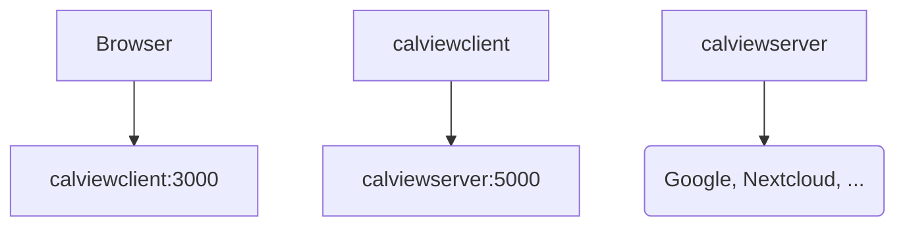

# Evironment Variables

| Variable      | Description                                            | Default        |
|---------------|--------------------------------------------------------|----------------|
| CALVIEWSERVER | URL of the calviewserver that processes your calendars | localhost:5000 |

# Usage

Use docker-compose, see `docker-compose.yml` for an example.

General overview:

