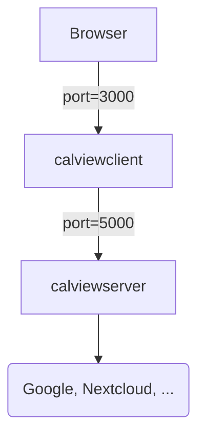

# Evironment Variables

| Variable        | Description                                                       | Default                           |
|-----------------|-------------------------------------------------------------------|-----------------------------------|
| CALENDAR_URL    | URL of the server you store your calenders on e.g. your nextcloud | https://localhost/remote.php/dav/ |
| CALENDAR_USER   | Username to login to the server                                   | root                              |
| CALENDAR_TOKEN  | Token/App-Password to login to the server                         | IMUQT-VLXJX-QTDEZ-CDBMW           |
| UPDATE_INTERVAL | How often the server is contacted for calender updates in minutes | 15                                |

# Usage

Use docker-compose, see `docker-compose.yml` for an example.

General overview:

